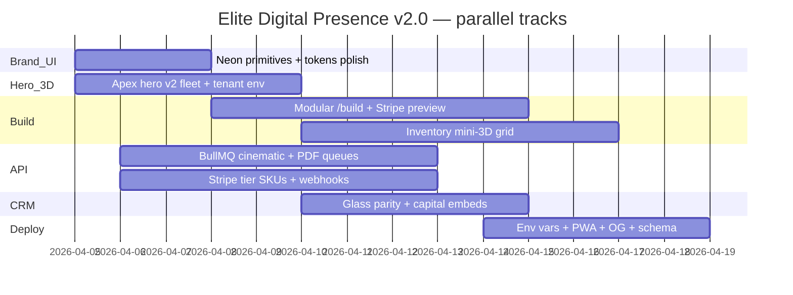

# VEX Elite Digital Presence Directive v2.0 — Crown Jewel Protocol

**Date:** 2026-04-05  
**Status:** Active — single expanded spec for marketing, 3D, CRM mirror, and GTM tiers.  
**Supersedes breadth of:** [2026-04-05-vex-ELITE-DIGITAL-PRESENCE-v2.md](2026-04-05-vex-ELITE-DIGITAL-PRESENCE-v2.md) (summary) — use **this file** for wireframes, paths, Gantt, and acceptance criteria.  
**Operational WebGL + GTM detail:** [2026-04-04-vex-ELITE-DIGITAL-PRESENCE-v1.md](2026-04-04-vex-ELITE-DIGITAL-PRESENCE-v1.md) §21+ (LOD, draw calls, reduced motion), §26–30 (revenue, Cox, autonomy, firepower).

**Branch target:** `elite-digital-presence-v1` → `main` per [PILOT_SHIP.md](../PILOT_SHIP.md).

**Configurator expansion (v2.1):** [Apex Studio v1.0 plan](2026-04-05-vex-apex-studio-configurator-v1.0.md) — `/build` digital twin factory, schemas, queue stubs, Gantt.

---

## Vision — VEX aesthetic

- **Base:** obsidian void `#0A0A0A` + elevated void layers.  
- **Energy:** violet → gold metallic gradients (`#A020F0` → `#FFD700`), used sparingly for CTAs, particles, rim light.  
- **Cinema:** film grain + volumetric god-rays + bloom/DOF in **vortex** mode (`VortexPostFXStack`).  
- **Motion:** **60 fps** target; `prefers-reduced-motion` disables heavy motion (see v1 §24).  
- **White-label:** tenant uniforms via `TenantCinematic3d`, `tenantCinematicUniformPatch`, CSS vars on `apps/web` + `apps/crm`.

---

## 1. Global brand system (`@vex/ui` + `@vex/shared`)

| Concern | Implementation / path |
|--------|-------------------------|
| Luxury tokens | `packages/ui/src/luxuryTokens.ts` — `vexLuxuryTokens` |
| Enterprise panels | `packages/ui/src/components.tsx` — `VexPanel`, `VexMetricCard` |
| Elite primitives | `packages/ui/src/elite.tsx` — `NeonCard`, `VortexButton`, `LiquidMetalCTA`, `GlassKPI`, `Luxury3DCard`, `MagneticButton` |
| Tenant 3D / HDR | `packages/shared` — `TenantCinematic3d`, `tenantCinematicUniformPatch`; web: `apps/web/src/lib/tenantConfigureAssets.ts` |
| Animation | `CinematicMotionProvider` / Lenis + GSAP in web shell; R3F `useFrame` capped by LOD (`resolveParticlePointBudget` in `@vex/3d-configurator`) |

**Target:** theme-critical CSS resolve **&lt;100ms** P75 after edge/cache warm — measure in RUM when deployed.

---

## 2. Hero experience (`apps/web`)

| Mode | Entry | Behavior |
|------|--------|----------|
| **Vortex** | `DynamicHeroShell` | `ApexHeroScene` → `@vex/ui/3d` `VortexHeroScene` + `ParticleVortex` (≤512, LOD) + post-FX + optional GLSL car |
| **Vault** | same | `DealerProgramHero` + `VaultNeonCursorSheen` + optional `HeroCinematicLayer` |
| **Pending** | same | Dark placeholder until `useWebglEligible` resolves |

**Key files:**

- `apps/web/src/components/hero/DynamicHeroShell.tsx`  
- `apps/web/src/components/hero/VortexHeroScene.tsx`  
- `apps/web/src/components/hero/ApexHeroScene.tsx` (re-export)  
- `packages/ui/src/3d/VortexHeroScene.tsx`, `ParticleVortex.tsx`, `VortexPostFXStack.tsx`  
- `apps/web/src/hooks/useHeroWebglDisplayMode.ts`, `useWebglEligible.ts`  
- Env: `NEXT_PUBLIC_ENABLE_HERO_WEBGL`, `NEXT_PUBLIC_CINEMATIC_*` — `apps/web/.env.local.example`

**Phase 1 backlog (v2 hero):** instanced GLTF fleet + BVH culling; tenant `environmentMapURL` fully wired on hero (partially live on configure — see v4.4 notes in README).

---

## 3. Core conversion engines

| Surface | Path | Notes |
|---------|------|--------|
| Configurator | `apps/web/src/app/build/page.tsx`, `components/configurator/*` | PBR `VehicleScene`, `GltfVehicle`, `ShowroomPostFX`, WebGPU probe `data-vex-webgpu` |
| Inventory | `apps/web/src/app/inventory/*`, `components/inventory/*` | 3D viewer with same WebGL gate |
| Trade-in | API `POST /public/quick-appraisal` | Tenant-scoped; valuation caps in API |
| Funnel | Hero CTA → `/build` → checkout | Stripe server-signed sessions only |

---

## 4. CRM mirror (`apps/crm`)

- Glass / void: `apps/crm/src/app/globals.css`, nav modules.  
- Charts: Recharts in dashboard routes; align tokens with `vexLuxuryTokens` over time.  
- RBAC: STAFF | ADMIN | GROUP_ADMIN — see `docs/TENANT_RBAC.md`.

---

## 5. Investor & capital

- Routes: `apps/web/src/app/investor`, `/investor-deck`, `/capital`.  
- README “Investor + cinematic surfaces” section — live URLs when deployed.  
- No fabricated SOC2 claims — badges = roadmap or verified status only.

---

## 6. Enterprise backbone (`apps/api`)

- Tenant: AsyncLocalStorage + Prisma middleware (see `ENGINEERING_REALITY.md`).  
- Jobs: BullMQ expansion for 3D/PDF — idempotent, tenant-scoped (spec v1 §16).  
- Observability: `GET /metrics`, OpenTelemetry hooks — WebGL traces = client-side + RUM (roadmap).

---

## 7. Deployment & quality

- Manifests: `render.yaml`, `vercel.json` — extend with `NEXT_PUBLIC_VEX_DOMAIN`, cinematic flags as needed.  
- PWA / OG / schema.org — Phase 5 in Gantt below.

---

## Wireframes (ASCII)

### Home `/`

```
┌─────────────────────────────────────────────────────────────┐
│ Header (glass)                                               │
├─────────────────────────────────────────────────────────────┤
│ FULL VIEWPORT — DynamicHeroShell                             │
│  [ vortex: R3F | vault: CSS+video | pending ]                 │
│  Overlay: headline, VortexButton CTAs, KPI glass              │
├─────────────────────────────────────────────────────────────┤
│ Sections: engines, marquee, pillars, ConfiguratorPreview      │
│ Featured inventory, trust                                    │
└─────────────────────────────────────────────────────────────┘
```

### `/build`

```
┌──────────────┬──────────────────────────────────────────────┐
│ Steps + opts │ ConfiguratorVehicleCanvas → VehicleScene     │
│ NeonCard     │ Commission sheet + Stripe path               │
└──────────────┴──────────────────────────────────────────────┘
```

### CRM dashboard

```
┌ Nav (glass) ─────────────────────────────────────────────────┐
│ GlassKPI / metric row                                         │
│ Charts + tables                                              │
└──────────────────────────────────────────────────────────────┘
```

---

## Performance budgets & acceptance criteria

| ID | Metric | Target | Verified by |
|----|--------|--------|-------------|
| P1 | Hero fps | 60 fps mid-tier GPU | Chrome Performance (manual) |
| P2 | Particles | ≤512 cap; LOD 128–512 | `resolveParticlePointBudget` + v1 §21 |
| P3 | Draw calls | &lt;100 after batching | Future: instanced fleet |
| P4 | Lighthouse perf | ≥0.8 (`lighthouserc.json`) | CI / local |
| P5 | Lighthouse a11y | ≥0.9 | `quality:web` + Lighthouse |
| P6 | Build | Green | `pnpm -w turbo run build` |
| P7 | Web smoke | Pass | `pnpm --filter @vex/web run quality:web` |

**Stretch:** Lighthouse perf 0.98+ on **static** or **legacy** hero variant — not guaranteed for full **vortex** without a perf-specific landing experiment.

**Conversion (hypothesis — instrument before claiming):** Qualified sessions: **vortex** hero + `/build` depth may lift **hero→configurator** conversion **15–40%** vs flat baseline; **>40%** is a **stretch lab target** only — requires controlled funnel + statistical power.

---

## Monetization tiers (GTM matrix)

| Tier | Positioning | Headline includes |
|------|-------------|-------------------|
| **Vortex** | Entry / growth | Full CRM + inventory + appraisals + customer portal (maps to self-serve **Starter / Pro** on `/pricing`) |
| **Apex** | Cinematic core | White-label **3D hero + embed**, branded portal, custom domain, CRM premium lane, higher valuation quota (quote-based) |
| **Quantum** | Enterprise | **Multi-rooftop**, GROUP_ADMIN hierarchy, **AI valuation** + autonomous workflow hooks (where product allows), **dedicated** cinematic/asset pipeline, SLA, DMS integration priority, optional **transaction**-linked fees |

**Revenue mix (illustrative):** recurring SaaS + usage (3D/API) + white-label license + integration fees — exact SKUs in Stripe dashboard.

---

## Quantum tier — enterprise sales collateral (feature matrix)

| Pillar | Quantum intent |
|--------|----------------|
| **Org** | Groups, locations, delegated admin, audit-heavy actions |
| **Cinematic** | Custom HDR/particle palettes, priority asset pipeline, branded CRM **mirror** of web vault |
| **Intelligence** | Valuation automation at scale; roadmap: co-pilot surfaces (tenant-scoped, consent) |
| **Data** | Read replicas, exports, investor-safe aggregates (RBAC) |
| **Trust** | SOC2-oriented practices — ship **truthful** badges only |

---

## Sprint Gantt (parallel tracks)



---

## Verification commands (non-negotiable)

```bash
pnpm install
pnpm --filter @vex/api run db:generate   # if API build is in scope
pnpm -w turbo run build
pnpm --filter @vex/web run quality:web
```

**Ship mirror (with DB):** `pnpm run ship:gate` — see `docs/SHIP.md`.

---

## File path index (quick navigation)

| Area | Paths |
|------|--------|
| Hero shell | `apps/web/src/components/hero/DynamicHeroShell.tsx` |
| WebGL perf | `packages/3d-configurator/src/index.ts` |
| UI 3D | `packages/ui/src/3d/*` |
| UI elite | `packages/ui/src/elite.tsx` |
| Configurator | `apps/web/src/components/configurator/*` |
| Plans | `docs/plans/2026-04-05-vex-ELITE-DIGITAL-PRESENCE-v2.0.md` (this file) |

---

## Synchronization

- **READY — HERO v2:** `pnpm -w turbo run build && pnpm --filter @vex/web run quality:web` green + Phase 1 hero items in Gantt checked in repo or PR description.  
- **READY — PLAN v2.0:** This document committed; entry points (`README`, `PROJECT_SPACE`, `AGENTS`) link here.

---

*Elite Digital Presence Directive v2.0 — activated.*
